# Model Architecture

Pip runs three separate neural networks, each doing one job, wired together
by a small amount of Python glue (`State`, `IntentHandler`, `Threads`). This
document is the map: what each model is, and how activations/text flow
between them.

## 1. The model stack

```mermaid
flowchart TB
    RM["<b>1. Robot Model</b><br/>numpy + scikit-learn MLPClassifier<br/>runs in Mind's tick loop, &Delta;/&Gamma; Hz (asleep/awake)"]
    OL["<b>2. Ollama / HailoRT LLM</b><br/>Qwen2.5:1.5B-Instruct<br/>(Ollama on CPU, or a compiled .hef on Hailo-10H)"]
    LORA["<b>2.a LoRA personality wrapper</b><br/>optional fine-tuned adapter<br/>(replaces the text personality prompt when set)"]
    WH["<b>3. \"Whistler\"</b><br/>Whisper (Small), on HailoRT<br/>speech-to-text"]
    PIPER["<b>Piper</b><br/>text-to-speech"]

    RM --> OL
    OL -. wraps .-> LORA
    OL --> WH
    WH --> PIPER
```

| #   | Model                        | Framework / runtime                                                                                 | Role                                                                                                        |
| --- | ---------------------------- | --------------------------------------------------------------------------------------------------- | ----------------------------------------------------------------------------------------------------------- |
| 1   | **Robot Model**              | scikit-learn `MLPClassifier` (16,16 hidden layers) + `StandardScaler`, both `joblib`-pickled        | Turns a small numeric snapshot of the robot's state into an **intent** (idle/sleep/wake/prompt/utter/speak) |
| 2   | **Ollama / HailoRT LLM**     | `Qwen2.5:1.5B-Instruct`, served by Ollama (CPU) or `hailo_platform.genai.LLM` on a Hailo-10H `.hef` | Turns a prompt + conversation context into a reply                                                          |
| 2.a | **LoRA personality wrapper** | GGUF adapter (Ollama) or a fine-tuned/fused checkpoint                                              | Optional; when configured, it _is_ Pip's personality and the base text system-prompt is disabled            |
| 3   | **"Whistler"**               | `Whisper (Small)` via `hailo_platform.genai.Speech2Text` on Hailo-10H                               | Turns microphone audio into text                                                                            |
| —   | **Piper**                    | ONNX TTS, driven as a subprocess                                                                    | Turns text into speech audio                                                                                |

Model 1 is the only one that runs on a fixed clock. Models 2 and 3 are
event-driven: the LLM runs when there's a prompt to answer, Whisper runs
when the noise gate opens on an utterance.

## 2. Runtime data flow

This is the same three models plus Piper, but drawn as the actual running
system: threads, the shared `State` object, and the feedback loop that
takes a Robot Model activation all the way to speech.

```mermaid
flowchart TB
    subgraph Ears["Ears - own background thread"]
        MIC(["Microphone"]) --> GATE["WebRTC VAD\n(needs a short burst of\nconsecutive positive frames)"]
        GATE --> S2T["Whisper-Small\nSpeech2Text.generate_all_text"]
        S2T -->|wake word found| ON_WAKE["on_wake"]
        S2T -->|any accepted text| ON_RECORD["on_record"]
    end

    ON_WAKE --> STATE
    ON_RECORD --> STATE[("State\nprompts / eavesdrop /\nis_speaking / is_thinking / ...")]

    subgraph Brain["Brain thread - interval = 1/&Delta; or 1/&Gamma;"]
        STATE -->|get_context&#40;&#41; 8-value vector| SCALE["StandardScaler.transform"]
        SCALE --> MLP["Robot Model\nMLPClassifier.predict_proba"]
        MLP -->|argmax + confidence &gt; threshold| INTENT["IntentHandler.handle&#40;action&#41;"]
    end

    FREQ["Frequency-manager thread"] -. "sets interval\n(awake -> &Gamma;, asleep -> &Delta;)" .-> Brain

    INTENT -->|action = PROMPT| MIND_CALL["mind.think&#40;prompts&#41;\n&#40;non-blocking&#41;"]
    INTENT -->|action = SPEAK| VOICE_CALL["voice.say&#40;response&#41;"]
    INTENT -->|action = SLEEP / WAKE / UTTER| STATE

    subgraph Mind["Mind - its own worker thread"]
        MIND_CALL --> LLM["Ollama / HailoRT LLM\nQwen2.5:1.5B &#40;+ LoRA&#41;"]
        LLM -->|streamed chunks, via callback| STATE
    end

    subgraph Voice["Voice - its own worker thread + subprocess"]
        VOICE_CALL --> TTS["Piper"]
        TTS --> SPEAKER(["Speaker"])
        TTS -->|on_speak| STATE
    end
```



Two things worth calling out because they're easy to miss reading the code
top-to-bottom:

- **The confidence gate is a hard cutoff.** `_brain_tick` only calls
  `IntentHandler.handle()` when `max(predict_proba) > BRAIN_CONFIDENCE_THRESHOLD`
  (0.9 by default). Below that, the tick is a no-op - the Robot Model can be
  "unsure" and nothing happens.
- **`IntentHandler.handle()` never blocks the brain thread.** It runs
  _inline_ on the brain thread (it's just a method call, not its own
  thread), but both `Mind.think()` and `Voice.say()` immediately hand off to
  _their own_ background worker (`lib.Threads.Process`) and return. So a
  multi-second LLM generation doesn't stall the 4-30 Hz tick loop - the
  brain keeps sampling `State` and can, for example, notice new eavesdropped
  speech while the previous answer is still being generated.

## 3. Robot Model activations -> intents

`State.get_context()` is the entire sensory input to the Robot Model - eight
numbers, no text:

```
[ chaos, awake_phase, has_pending_prompt, is_thinking,
  has_pending_response, is_speaking, last_spoke_time_diff, time_of_day ]
```

`chaos` is a random tie-breaker; the rest are plain flags/timers read off
`State`. `predict_proba` turns that into a probability per action, and
`argmax` picks the action:

| action | name      | what `IntentHandler` does                                           |
| ------ | --------- | ------------------------------------------------------------------- |
| 0      | idle      | nothing                                                             |
| 1      | sleep     | speaks a goodbye, `is_awake = False`                                |
| 2      | wake up   | `is_awake = True`, queues a `"hello"` prompt if none pending        |
| 3      | prompt    | drains `state.prompts`, calls `mind.think()` with eavesdrop context |
| 4      | utterance | queues a `"utter"` prompt                                           |
| 5      | speak     | pops one queued response, calls `voice.say()`                       |

So "prompts" and "responses" are just lists sitting on `State`, filled by
`Ears` (wake word / heard speech -> `state.prompts`) and by `Mind`'s
streaming callback (-> `state.responses`), and drained by the Robot Model's
own decisions about _when_ to act on them. The Robot Model doesn't know
anything about LLMs or audio - it only ever sees the eight numbers above,
which is why `is_thinking`/`is_speaking`/`has_pending_*` all feed back into
`get_context()`: they're how the outcome of one intent shows up as input to
the next tick.

## 4. Where each model is configured

| Model                    | Config                                                                                    | Code                                                                                                                  |
| ------------------------ | ----------------------------------------------------------------------------------------- | --------------------------------------------------------------------------------------------------------------------- |
| Robot Model              | `BRAIN_FREQUENCY_DELTA`, `BRAIN_FREQUENCY_GAMMA`, `BRAIN_CONFIDENCE_THRESHOLD`            | `src/main.py` (`_brain_tick`, `_brain_frequency_manager`), [`src/models/robot/`](robot/) (training guide, `train.sh`) |
| LLM                      | `LLM_ENGINE` (`ollama`/`hailo`), `OLLAMA_MODEL` / `HAILO_MODEL_HEF`, `PERSONALIZED_MODEL` | `src/lib/Mind.py`, `src/lib/hailo/client.py`, `src/models/ollama/`                                                    |
| LoRA personality wrapper | `LLM_LORA_PATH`                                                                           | `src/models/ollama/` (training guide, generated `Modelfile` in `build/`)                                              |
| Whisper ("Whistler")     | `HAILO_WHISPER_MODEL_HEF`                                                                 | `src/lib/Ears.py`                                                                                                     |
| Piper                    | `PIPER_MODEL_NAME`, `PIPER_SAMPLE_RATE`                                                   | `src/lib/Voice.py`                                                                                                    |
