# Model Architecture

Pip runs three separate neural networks, each doing one job, wired together
by a small amount of Python glue (`State`, `IntentHandler`, `Threads`). This
document is the map: what each model is, and how activations/text flow
between them.

## 1. The model stack

```mermaid
flowchart TB
    RM["<b>1. Robot Model</b><br/>numpy + scikit-learn MLPClassifier<br/>runs in Mind's tick loop, &Delta;/&Gamma; Hz (asleep/awake)"]
    OL["<b>2. Ollama / HailoRT LLM</b><br/>Ollama: trained personality model (own Modelfile SYSTEM prompt)<br/>Hailo: personality-tuned .hef on Hailo-10H"]
    WH["<b>3. \"Whistler\"</b><br/>Whisper (Small), on HailoRT<br/>speech-to-text"]
    PIPER["<b>Piper</b><br/>text-to-speech"]

    RM --> OL
    OL --> WH
    WH --> PIPER
```

| #   | Model                    | Framework / runtime                                                                                                                               | Role                                                                                                                              |
| --- | ------------------------ | ------------------------------------------------------------------------------------------------------------------------------------------------- | --------------------------------------------------------------------------------------------------------------------------------- |
| 1   | **Robot Model**          | scikit-learn `MLPClassifier` (16,16 hidden layers) + `StandardScaler`, both `joblib`-pickled                                                      | Turns a small numeric snapshot of the robot's state into an **intent** (idle/sleep/wake/prompt/speak) - spontaneous "utterance" is decided separately, in code |
| 2   | **Ollama / HailoRT LLM** | Ollama: trained model (`src/models/ollama/train.sh`) served on CPU; Hailo: personality-tuned `.hef` via `hailo_platform.genai.LLM` on a Hailo-10H | Turns a prompt + conversation context into a reply, personality baked in (Ollama's Modelfile SYSTEM directive, or the HEF itself) |
| 3   | **"Whistler"**           | `Whisper (Small)` via `hailo_platform.genai.Speech2Text` on Hailo-10H                                                                             | Turns microphone audio into text                                                                                                  |
| —   | **Piper**                | ONNX TTS, driven as a subprocess                                                                                                                  | Turns text into speech audio                                                                                                      |

Model 1 is the only one that runs on a fixed clock. Models 2 and 3 are
event-driven: the LLM runs when there's a prompt to answer, Whisper runs
when the noise gate opens on an utterance.

## 2. Runtime data flow

This is the same three models plus Piper, but drawn as the actual running
system: threads, the shared `State` object, and the feedback loop that
takes a Robot Model activation all the way to speech.

```mermaid
flowchart TB
    subgraph Ears["Ears - own background thread"]
        MIC(["Microphone"]) --> GATE["WebRTC VAD\n(needs a short burst of\nconsecutive positive frames)"]
        GATE --> S2T["Whisper-Small\nSpeech2Text.generate_all_text"]
        S2T -->|wake word found| ON_WAKE["on_wake"]
        S2T -->|any accepted text| ON_RECORD["on_record"]
    end

    ON_WAKE --> STATE
    ON_RECORD --> STATE[("State\nprompts / eavesdrop /\nis_speaking / is_thinking / eavesdropped_context / ...")]

    subgraph Brain["Brain thread - interval = 1/&Delta; or 1/&Gamma;"]
        STATE -->|get_context&#40;&#41; 5-value vector| SCALE["StandardScaler.transform"]
        SCALE --> MLP["Robot Model\nMLPClassifier.predict_proba"]
        MLP -->|argmax + confidence &gt; threshold| INTENT["IntentHandler.handle&#40;action&#41;"]
        INTENT -->|action == Nothing| UTTER["Utterances.consider&#40;&#41;\neavesdropped_context / time_since_heard"]
    end

    FREQ["Frequency-manager thread"] -. "sets interval\n(awake -> &Gamma;, asleep -> &Delta;)" .-> Brain

    INTENT -->|action = PROMPT| MIND_CALL["mind.think&#40;prompts&#41;\n&#40;non-blocking&#41;"]
    INTENT -->|action = SPEAK| VOICE_CALL["voice.say&#40;response&#41;"]
    INTENT -->|action = SLEEP / WAKE / UTTER| STATE

    subgraph Mind["Mind - its own worker thread"]
        MIND_CALL --> LLM["Ollama / HailoRT LLM\ntrained model / personality-tuned .hef"]
        LLM -->|streamed chunks, via callback| STATE
    end

    subgraph Voice["Voice - its own worker thread + subprocess"]
        VOICE_CALL --> TTS["Piper"]
        TTS --> SPEAKER(["Speaker"])
        TTS -->|on_speak| STATE
    end
```



Two things worth calling out because they're easy to miss reading the code
top-to-bottom:

- **The confidence gate is a hard cutoff.** `_brain_tick` only calls
  `IntentHandler.handle()` when `max(predict_proba) > BRAIN_CONFIDENCE_THRESHOLD`
  (0.9 by default). Below that, the tick is a no-op - the Robot Model can be
  "unsure" and nothing happens.
- **`IntentHandler.handle()` never blocks the brain thread.** It runs
  _inline_ on the brain thread (it's just a method call, not its own
  thread), but both `Mind.think()` and `Voice.say()` immediately hand off to
  _their own_ background worker (`lib.Threads.Process`) and return. So a
  multi-second LLM generation doesn't stall the 4-30 Hz tick loop - the
  brain keeps sampling `State` and can, for example, notice new eavesdropped
  speech while the previous answer is still being generated.

## 3. Robot Model activations -> intents

`State.get_context()` is the entire sensory input to the Robot Model - five
numbers, no text:

```
[ awake_phase, has_pending_prompt, is_thinking, has_pending_response,
  is_speaking ]
```

All plain flags read off `State`. `predict_proba` turns that into a
probability per action, and `argmax` (mapped through `model.classes_`, since
label 4 is never one of the model's own classes - see below) picks the
action:

| action | name      | what decides it                                                              | what `IntentHandler` does                                           |
| ------ | --------- | ----------------------------------------------------------------------------- | -------------------------------------------------------------------- |
| 0      | idle      | Robot Model                                                                   | nothing                                                             |
| 1      | sleep     | Robot Model                                                                   | speaks a goodbye, `is_awake = False`                                |
| 2      | wake up   | Robot Model                                                                   | `is_awake = True`, queues a `"hello"` prompt if none pending        |
| 3      | prompt    | Robot Model                                                                   | drains `state.prompts`, calls `mind.think()` with eavesdrop context |
| 4      | utterance | `Utterances.consider()` (only checked from `IntentHandler`'s own action == 0 branch) | confidence-weighted coin flip, then queues a `"utter"` prompt       |
| 5      | speak     | Robot Model                                                                   | pops one queued response, calls `voice.say()`                       |

So "prompts" and "responses" are just lists sitting on `State`, filled by
`Ears` (wake word / heard speech -> `state.prompts`) and by `Mind`'s
streaming callback (-> `state.responses`), and drained by the Robot Model's
own decisions about _when_ to act on them. The Robot Model doesn't know
anything about LLMs or audio - it only ever sees the five numbers above,
which is why `is_thinking`/`is_speaking`/`has_pending_*` all feed back into
`get_context()`: they're how the outcome of one intent shows up as input to
the next tick.

**Why utterance isn't a model class**: it depends on `eavesdropped_context`
(word count overheard) and `time_since_heard` (silence duration) - both were
tried as Robot Model features gated by a random `chaos` value, but the
resulting region was too narrow and rare for that classifier to reliably
separate from the broad "nothing to do" rules around it
(StandardScaler-normalized MLP decision boundaries can't hold a fine
distinction there). It's pulled out into `IntentHandler.handle()`
(`src/intents.py`) calling `Utterances.consider()` (`src/utterances.py`)
from its own `action == 0` branch instead, which splits the two features by
what they actually are: `eavesdropped_context` is a hard step condition
(code, not a model - `if context < MIN_CONTEXT: return None`), while
`time_since_heard -> confidence` is a genuine smooth curve, which is
exactly what a neural net fits well. That part is now its own tiny
`MLPRegressor` (`src/models/robot/training/train_utterance.py`,
`build/utterance_model.pkg`), separate from the Robot Model itself. The
resulting confidence then feeds `confidence * random() > random()` -
eligibility, the learned curve, and the "free will" randomization are all
independently testable, instead of hoping one trained classifier boundary
lands in the right place for everything at once.

## 4. Where each model is configured

| Model                | Config                                                                         | Code                                                                                                                  |
| -------------------- | ------------------------------------------------------------------------------ | --------------------------------------------------------------------------------------------------------------------- |
| Robot Model          | `BRAIN_FREQUENCY_DELTA`, `BRAIN_FREQUENCY_GAMMA`, `BRAIN_CONFIDENCE_THRESHOLD` | `src/main.py` (`_brain_tick`, `_brain_frequency_manager`), [`src/models/robot/`](robot/) (training guide, `train.sh`) |
| LLM                  | `OLLAMA_MODEL_NAME`                                                            | `src/lib/Mind.py`, `src/lib/ollama/client.py`, `src/models/ollama/`                                                   |
| Whisper ("Whistler") | `WHISPER_MODEL_HEF`                                                            | `src/lib/Ears.py`                                                                                                     |
| Piper                | `PIPER_MODEL_NAME`, `PIPER_SAMPLE_RATE`                                        | `src/lib/Voice.py`                                                                                                    |
